# S5_BAO_taxi-brousse

A management system for intercity bus (taxi-brousse) operations in Madagascar, covering the full lifecycle: scheduling routes, assigning buses, taking reservations, resolving fares, processing payments, and invoicing both ticket and advertising revenue.

It was built as a database-oriented project, and the interesting part turned out to be pricing. A fare here is not a number on a route: it depends on which bus is running the trip, which seat class was booked, which age group the passenger falls into, and which date you're asking about. Getting that to resolve predictably, and to stay auditable when prices change, was the actual work.

## Features

### What it does

- Fleet and route management: define voyages between stations, configure seat classes per bus, assign buses to specific dated departures
- Multi-dimensional fare resolution across voyage, bus, seat class, passenger age group, and date
- Age-based discounts expressed as either an absolute override or a percentage of the adult fare
- Reservation workflow with visual seat selection and status tracking
- Payments in cash, Mobile Money, or card, logged through a caisse system
- Advertising slots sold to companies against specific departures, with advance payments and outstanding balances tracked
- Invoices combining ticket revenue, advertising revenue, and onboard product orders
- Price history: every fare change is recorded for audit
- Dashboard with revenue trends, top routes, top clients, and passenger demographics

### A few decisions worth explaining

- **Fares resolve through an explicit priority chain rather than a single lookup.** The order is: an age-and-class configuration scoped to that voyage and active on that date, then the price specific to that bus on that departure, then the route's own price, then the seat class's fallback price. First match wins. Modelling it as a chain rather than one table means a route can carry a general price while a single busy departure overrides it, without either needing to know about the other.
- **A fare configuration is either an absolute amount or a percentage of a baseline.** Percentages resolve by first finding the adult absolute price for the same class and voyage, then applying the modifier. Storing "child pays 50%" as a percentage rather than a fixed amount means raising the adult fare doesn't silently leave child fares stale.
- **Discounts are derived, never stored.** There is no discount column anywhere. A discount exists when the resolved price for a passenger comes out below the adult baseline for the same seat and voyage, and the displayed percentage is computed from that gap. One source of truth, so a price and its "20% off" label cannot disagree.
- **Price history records changes, not saves.** Updating a departure's price compares old against new (with a float tolerance) and only writes a history row when the value actually moved. The audit trail is therefore a log of real decisions rather than a log of times someone opened the edit form.
- **Prices are resolved as of a date, not as of now.** Every lookup takes a pricing date and filters configurations by their active period, which is what lets a past reservation still be explained at the fare that applied when it was made.
- **Overlapping date ranges are resolved rather than forbidden.** Advertising tariffs are looked up by "active on this date, most recently started first", so publishing a new tariff supersedes an older overlapping one without requiring anyone to go back and close the previous period. Same instinct as the fare chain: define a resolution order instead of a constraint that has to be maintained by hand.
- **Invoice generation is idempotent.** Asking for a departure's invoice returns the existing one if there is one rather than issuing a duplicate, because "generate invoice" is a button a user will press twice.
- **Bus capacity is summed from configuration rows rather than stored as a number.** A bus carries `nb_place_*` entries per seat class, and total capacity is their sum, so adding a new seat class doesn't require a schema change. The honest cost is that these are string-keyed values needing parsing and case normalisation, and a missing configuration surfaces as a thrown `CapacityConfigurationException` rather than a compile-time error.

## Screenshots

### Dashboard

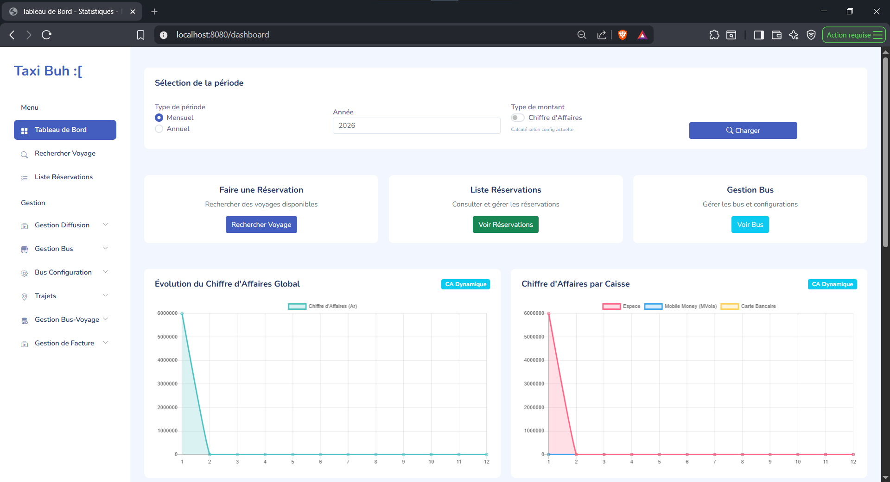

Revenue evolution over time, revenue split by caisse, the five most reserved routes, the ten most profitable clients, and passenger demographics by gender and age group. Period and revenue-type filters drive all of it.

### Booking Flow

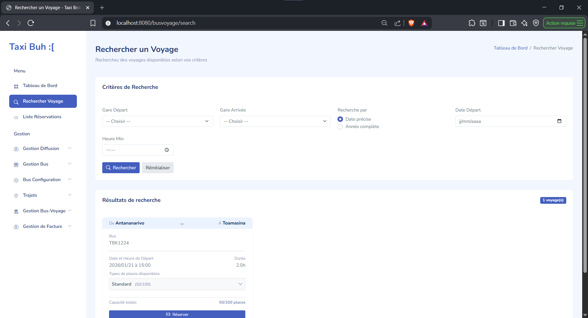

Search by departure and arrival station, date, and time. Results show the assigned bus, its available seat classes, and the fare each class resolves to for the selected passenger, computed through the priority chain before anything is booked.

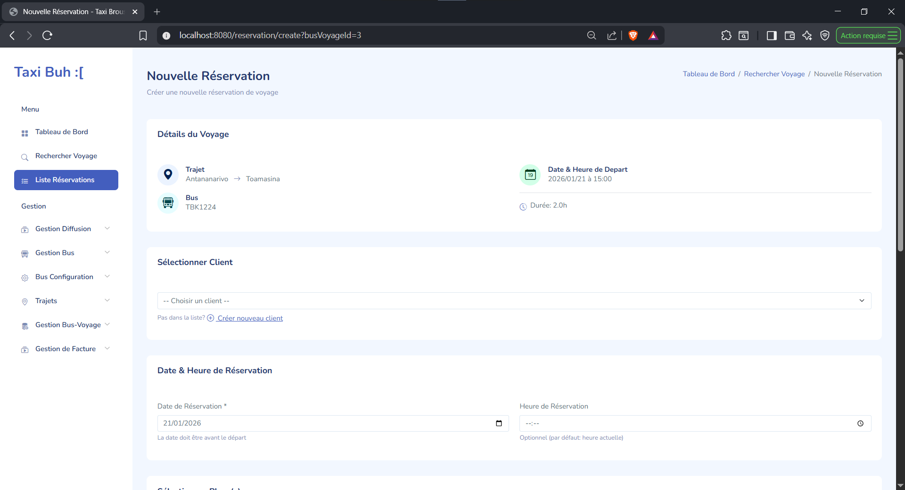
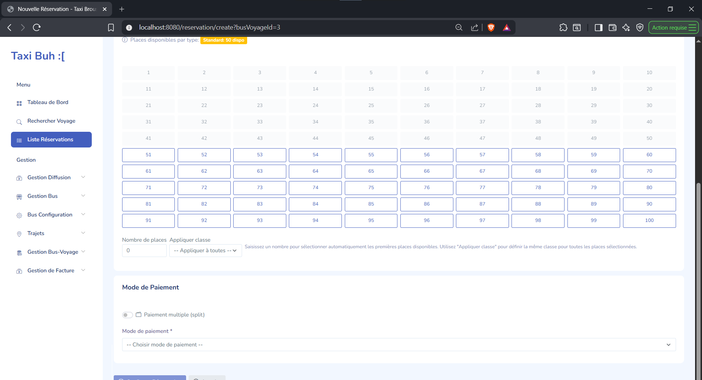

Booking runs in two steps: pick the departure and the client, then select seats on a visual grid and settle payment. The client's age group is what pulls the applicable discount into the fare, so the price shown here is already the price they pay.

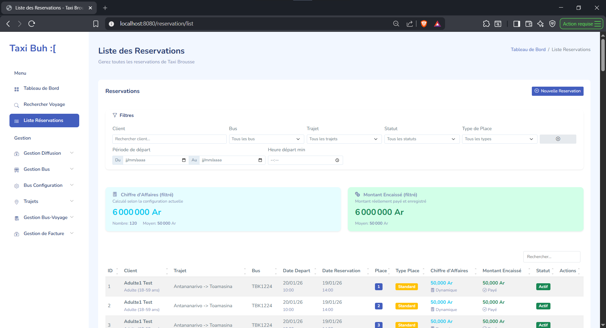

All reservations with revenue summaries, filterable by client, bus, route, date, status, and seat class.

### Fleet, Routes & Scheduling

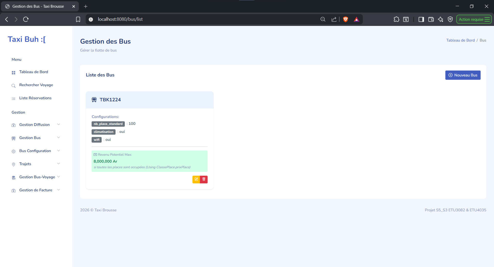
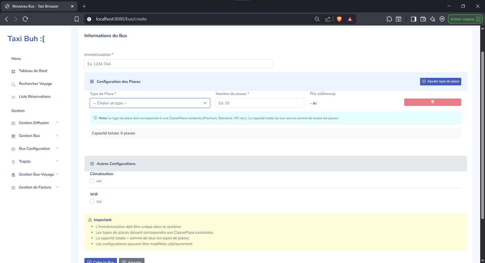
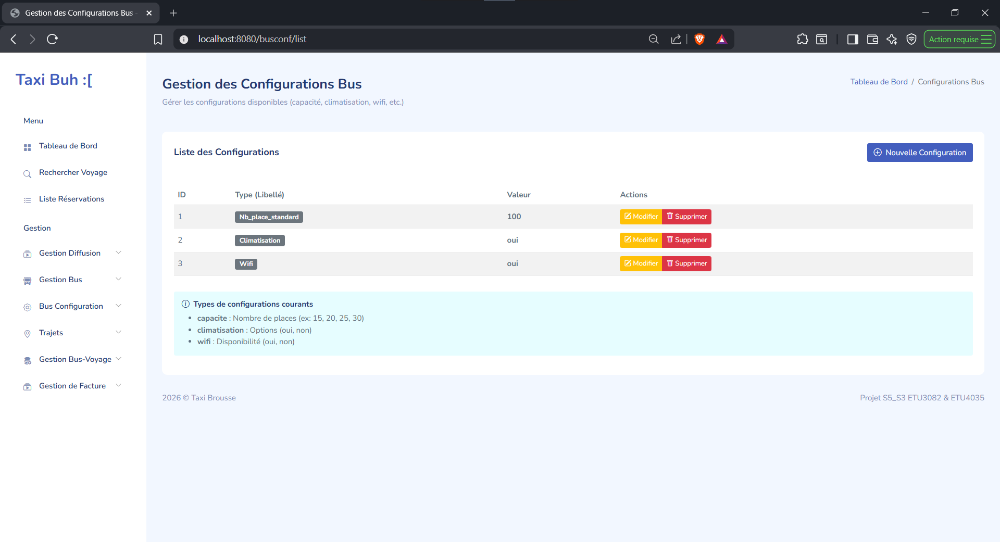

Buses carry their seat class configuration as quantities per class, which is where total capacity and maximum revenue potential are derived from. Configurations can't be deleted while a bus still references them.

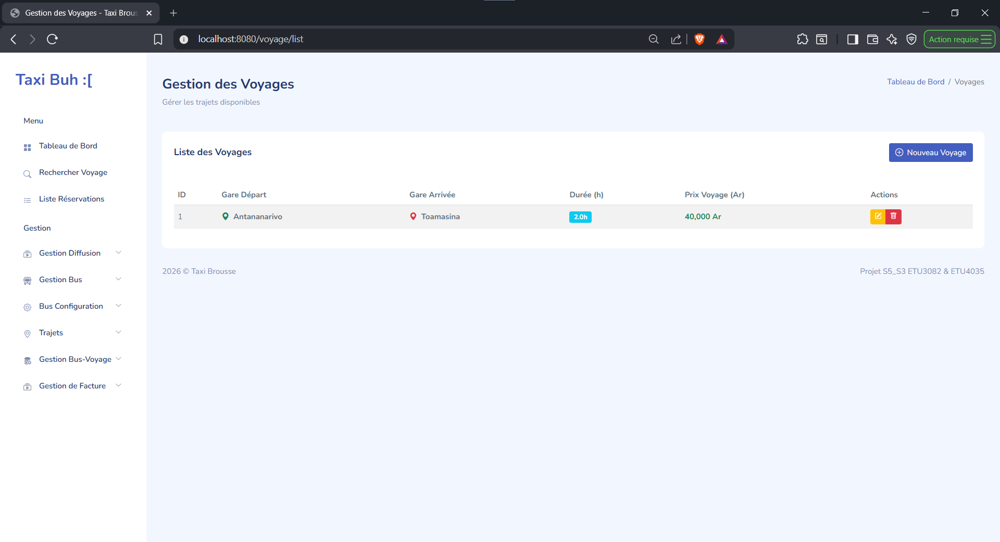
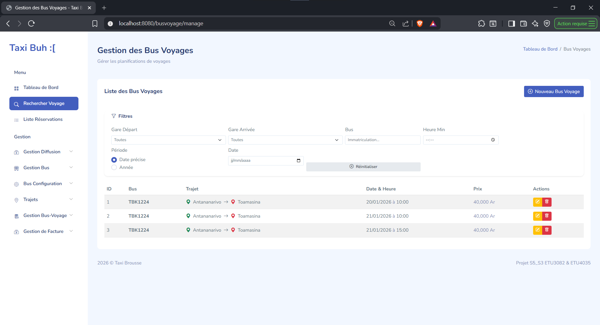

Routes define the station pair, duration, and base price. Assigning a bus to a route on a given date creates the departure that reservations actually attach to, and that departure can carry its own price override.

### Advertising

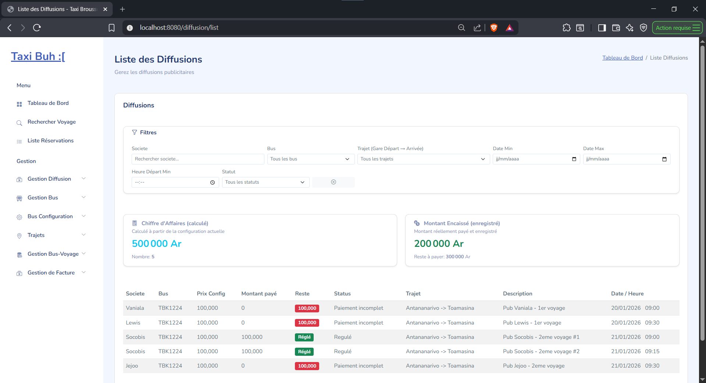
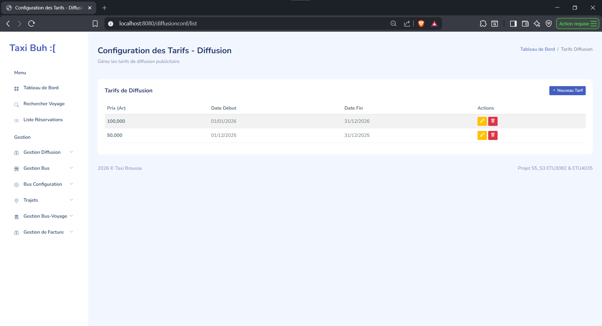

Companies book advertising slots against specific departures. Tariffs are configured over date ranges, and when ranges overlap the one that started most recently wins, so a newer tariff supersedes an older one without anyone having to close the old period first. Payments are tracked against each booking, leaving a visible outstanding balance.

### Invoicing

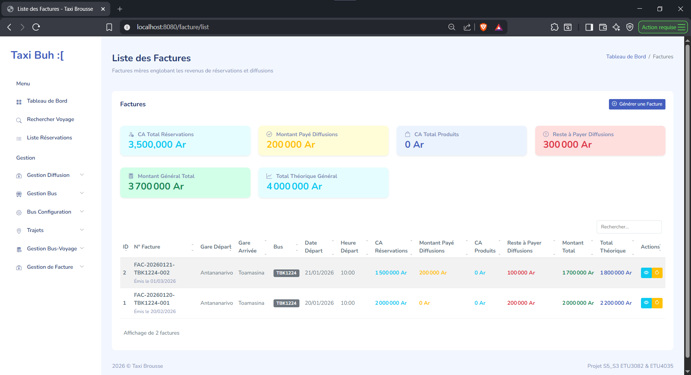
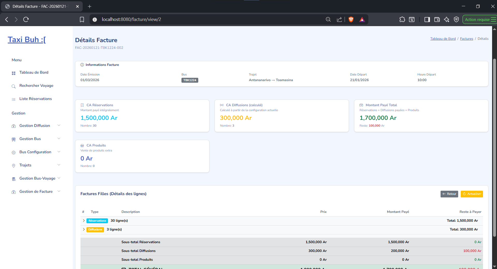

An invoice for a departure pulls together three separate revenue streams — ticket reservations, advertising, and onboard product orders — as distinct line groups under one total.

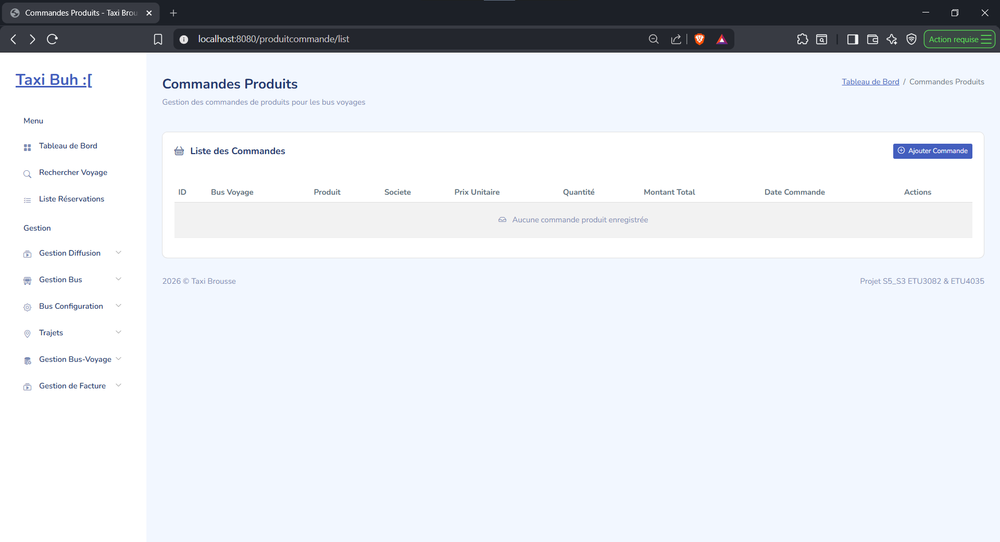
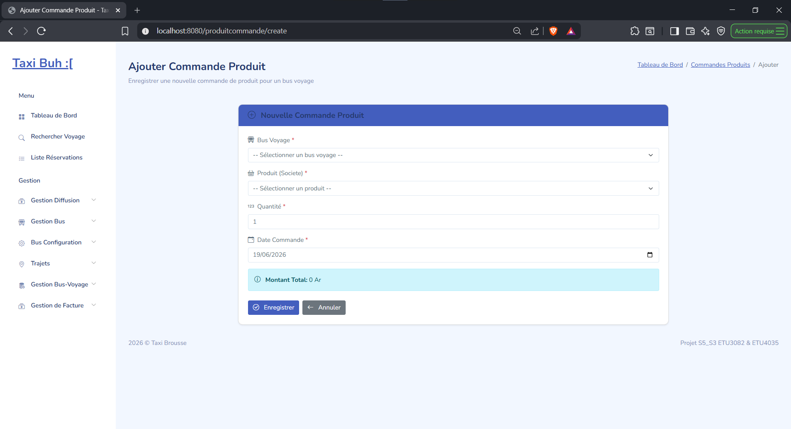

Product orders placed by companies against a specific departure, priced per unit and folded into that departure's invoice.

## Tech Stack

- Backend: Java + Spring Boot
- Frontend: Thymeleaf
- Database: PostgreSQL
- Build: Maven (wrapper included)

## Getting Started

### Prerequisites

- Java 21+
- PostgreSQL
- Maven 3.9+ (optional, a wrapper is included)

### Local setup

```bash
git clone https://github.com/Snowlydial/S5_BAO_taxi-brousse.git
cd S5_BAO_taxi-brousse
```

```bash
cd sql
psql -U postgres -f Taxi_brousse.sql
psql -U postgres -f dataV4-simple.sql
cd ..
```

The second script is optional sample data. Then set your connection details in `src/main/resources/application.properties`:

```properties
spring.datasource.url=jdbc:postgresql://localhost:5432/your_db
spring.datasource.username=your_user
spring.datasource.password=your_password
```

```bash
# Windows
./mvnw.cmd spring-boot:run

# macOS/Linux
./mvnw spring-boot:run
```

Available at http://localhost:8080

## Database

Schema in `sql/Taxi_brousse.sql`, sample dataset in `sql/dataV4-simple.sql`.

The schema splits into three domains that meet at the departure. **Scheduling**: `Gare`, `Voyage` (a route between two stations), `Bus`, and `BusVoyage`, the join that turns a route plus a bus plus a date into an actual departure. **Pricing**: `ClassePlace`, `CategorieGroupeAge`, and `ClasseAgeConf`, which carries the age-and-class overrides with their active date range, backed by `HistoriquePrixVoyage` and `HistoriquePrixSpecifique` for audit. **Revenue**: `Reservation` and `Paiement` for tickets, `Diffusion` and `DiffusionPaiement` for advertising, `ProduitCommande` for onboard sales, all converging on `Facture` and `FactureLigne`.

`PricingService` is where the fare chain lives and is the piece worth reading first.

## Academic context

Built during Semester 5 at university as a business application, and served as a practical exercise in team leadership and project management alongside the technical work.
